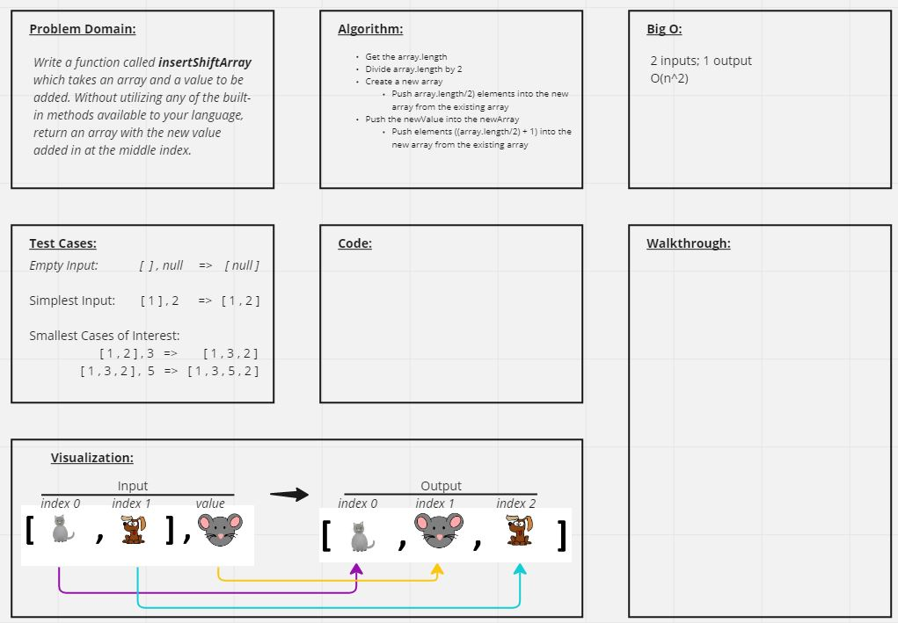

# Insert to Middle of an Array
Insert and shift an array in middle at index

## Whiteboard Process

## Approach & Efficiency
My approach to this challenge was to creat a new array and push the first half of the elements in the original array into it, then push the element to be inserted, and finally push the remaining elements to complete the new array. This seemed the most direct and logical approach to me at this stage of my development as a developer.