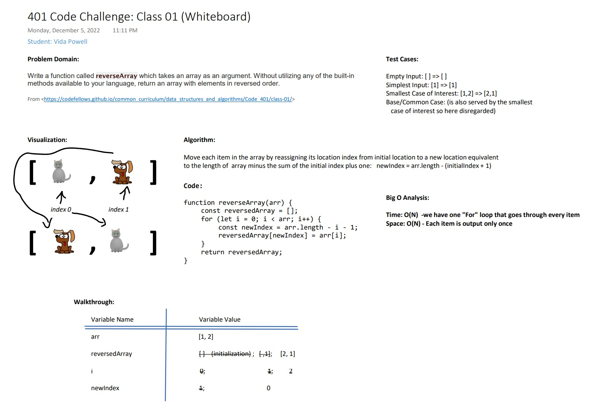

# Reverse an Array

Feature Task: Write a function called reverseArray which takes an array as an argument. Without utilizing any of the built-in methods available to your language, return an array with elements in reversed order.

## Whiteboard Process

## Approach & Efficiency

_What approach did you take? Discuss Why. What is the Big O space/time for this approach?_
I approached this problem with a for loop solution as it seemed the easiest and most direct solution path at this stage in my development.
As we have only one for loop Time = O(N); as each item is output only once Space = O(N).
