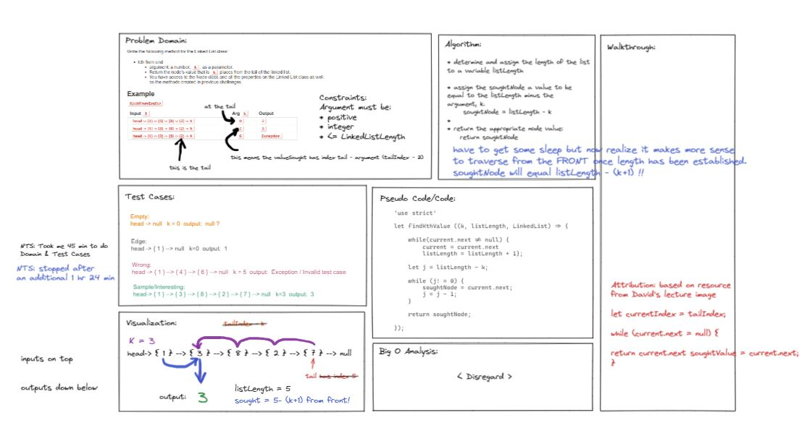

# Challenge Summary
Write the following method for the Linked List class:
* kth from end
  * argument: a number, k, as a parameter.
  * Return the node’s value that is k places from the tail of the linked list.
  * You have access to the Node class and all the properties on the Linked List class as well as the methods created in previous challenges.

## Whiteboard Process

* 45 minutes spend on Problem Domain box and Test Cases box
* 1 hr 24 minutes spent on Algorithm, Psuedo Code/Code, and general layout
* When I come back to this I'll finish re-working the algorithm and code to reflect traversing from head to the soughtNode and outputting it!

## Approach & Efficiency
Will have to come back to Big O analysis after I have more understanding of it.

## Solution
<!-- Show how to run your code, and examples of it in action -->